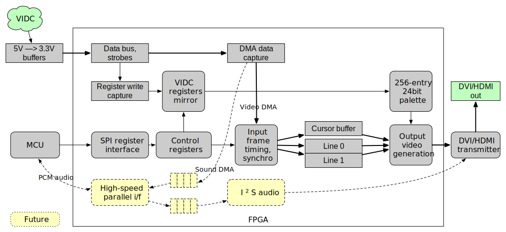

# ArcDVI-hw: Digital video output for the Acorn Archimedes

2 July 2023

ArcDVI is a hardware add-on allowing Acorn Archimedes computers to output video via DVI.  Retrocompute on a _quality_ monitor! :)

The ArcDVI project comprises several parts:
   * The [main PCB](https://github.com/evansm7/ArcDVI-PCB-main), and either an [interposer](https://github.com/evansm7/ArcDVI-PCB-VIDC-skt) that holds VIDC in socketed machines (e.g. A440), or a [clip-over](https://github.com/evansm7/ArcDVI-PCB-VIDC) board for machines in which VIDC is soldered down (e.g. A3000)
   * The [FPGA design](https://github.com/evansm7/ArcDVI-hw) (__This repo__)
   * The microcontroller [firmware](https://github.com/evansm7/ArcDVI-fw)
   * Optional extension/test [software](https://github.com/evansm7/ArcDVI-sw) for RISC OS

## What ArcDVI does

ArcDVI passively observes the signals to the VIDC chip in-circuit, and reconstructs the video display from VIDC's DMA requests.  The video data is output digitally on DVI.

ArcDVI doesn't require software support, but a mode extension module is available to add high-colour and extended palette modes to RISC OS.

In addition to pass-through, ArcDVI supports doubling pixels in X and Y to display TV/low-res screen modes on modern monitors.  For example, the 640x256 mode 12 is line-doubled and displayed as 640x512.

Not only does it look amazing, but it can provide new features.  For example:

   * The high-res mono mode 23 (1152x896) works beautifully on an A3000 (or A310) which otherwise doesn't have high-res mono hardware
   * High resolution modes (e.g. SVGA) without a VIDC enhancer, where an LCD monitor supports lower frame rate.  (I've been using mode 31 (800x600) at 37Hz stable and crisp on an LG monitor.)
   * Palette extension:  In the 1980s, silicon cost was a very limiting factor for storing large palettes.  The Arc has only 16 programmable 12-bit palette entries, but most FPGAs will have plenty of room to store a larger 256-entry 24-bit palette

ArcDVI: it saves you from the indignities of building a universally-working SCART cable!

ArcDVI: you can avoid hurting your back carrying CRTs around!

ArcDVI: fit more obsolete equipment on your desk by using flat-panel displays!  etc. etc. etc.


## How it works



First, the VIDC signals are converted to 3.3V.  The FPGA samples the data bus `D[31:0]` and `/VIDW` strobe to capture configuration register writes.  (The VIDC is write-only!)  VIDC registers are mirrored internally and provide screen timings, the cursor (pointer) position, and palette entries.

The data bus is also used when the (real) VIDC requests DMA, which it does for video, cursor or sound FIFO fills.  The circuit demultiplexes these three streams.  The video data fills a line buffer (and cursor data a cursor buffer).

The line buffer is double-buffered, so a stable input line is displayed while the next line is being captured.  Each pixel is scanned out twice to double in X, and/or each buffer is displayed twice to double in Y.

To do this, the output scan must be in close synchronisation to the input video data.  This way, only one line needs to be buffered (minimising hardware requirements).  The scan-out runs exactly one line behind the input (two when doubling), to display stable data.  One horizontal line is output in exactly the same total period as the input, though the blanking timing or even horizontal resolution may differ (e.g. in pixel-doubled modes).  Line-doubled modes output a line in exactly half the time, or two lines in exactly the same time as one input line.

This means the vertical timing matches the input exactly so that a frame output takes exactly the same time as input.

A non-expanded Archimedes (prior to A540/A5000 era) has a pixel clock derived from a 24MHz input.  This design usually outputs with a 24MHz pixel clock.  Slower modes (e.g. 8MHz/16MHz) end up getting line- and/or pixel-doubled to a 24MHz mode.  Some higher-resolution modes (or very high aspect ratios like mode 24) need to use a 36 or 48MHz pixel clock.

So, the current implementation's Lattice iCE40HX PLL is used to dynamically adjust the output pixel clock to give the maximum flexibility/compatibility in video output.


### High-res mono

The prototype did something clever to display mode 23 (1152x896@64Hz), using a 78MHz pixel clock (VIDC 24MHz x 3.25).  A mode 23 line is 1568 pixels (at 96MHz) wide.  The ratios are such that 1274 pixels at 78MHz take exactly the same period, and 1274 is wide enough to leave just enough blanking time (after 1152 displayed pixels).  This was done to keep the maximum pixel clock down in the prototype (which used a "soft" DVI serialiser).

However, this approach isn't required now: the FPGA  switches to a 96MHz pixel clock, outputs the VIDC mode directly, and performs appropriate 1bpp pixel formatting.


### DVI video output

The video is output via an external transmitter/serialiser, i.e. 24-bit video data, H/V/DE syncs and pixel clock.  The firmware performs setup/configuration of the serialiser.


### Microcontroller interface

An external microcontroller talks to the FPGA over SPI, and the video transmitter over I2C.

The SPI interface turns a 48-bit SPI transfer into an internal 32-bit read/write to a 12-bit address, allowing the microcontroller to perform register accesses in the FPGA.  In this way, the VIDC, video configuration, and status registers are exported to the MCU.

The firmware reads out the VIDC register state, programming new output configurations into the FPGA when the Archimedes screen mode changes.

WIP:  A simple parallel interface is under development for larger transfers of audio data.  The intention here is for the MCU to be able to receive a stream of audio data, perform DSP/SRC, and return a new stream to the FPGA for I2S output.


### Verilog Safari

`src/soc_top_arcdvi.v` is the top-level.  `clocks.v` generates a system clock for the MCU/register interfaces, and a pixel clock.

`vidc_capture.v` monitors the VIDC pins, captures the VIDC registers, and demuxes the DMA streams.  It passes those streams/strobes to `video.v` which contains the video output configuration registers, and into `video_timing.v` which generates the output display timing and display data from the DMA stream.

24b RGB, Hsync, Vsync and blanking is exported back to the top level and output to the video transmitter.


## Building FPGA bitstream

Builds using Yosys/nextpnr-ice40.

```
make bitstream
```
The resulting `arcdvi-ice40.bit` file should be integrated into the firmware build, for FPGA programming upon system initialisation.

For board bring-up, a test build is provided...

```
make bitstream TARGET=test
```

The test bitstream is standalone and can generate DVI display/test patterns without needing to be plugged into an Arc.  This is good to verify soldering.  It also displays a pattern of stripes which correspond to the sampled VIDC inputs, which are (again) useful to verify all inputs are mobile/not stuck.


## Status/what works

This design is functionally complete for "version 1" features.

All normal desktop/game screen modes work correctly.  Generally, anything with a 320x256/640x256/640x480/640x512/800x600 resolution (at any colour depth) should display correctly.  Success usually depends on the display liking a resolution rather than ArcDVI: fortunately the pixel- and line-doubling makes monitors happy with all low-res modes.

The output timing calculation is dynamic, not hard-wired, so variants of stock modes are likely to work too.  For example, minor variants of mode 13 (e.g. games, demos) display correctly, such as 320x272 getting doubled to 640x544.

Of the [old-style RISC OS screen modes](http://www.riscos.com/support/users/userguide3/book3b/book3_17.html), all modes 0-36 display correctly on my equipment.  Modes 37-40 (896x352) get line-doubled to 896x704 which is too "square" for my monitor, and don't display.

A 24MHz pixel clock is good for most modes.  But, some very wide modes such as mode 24 (1056x256) will fail to be line-doubled with a 24MHz pixel clock as it isn't fast enough to output enough pixels in half the period.  The 36/48MHz pixel clocks are enabled for such modes.


### Extended colour
ArcDVI expands the colour capabilities beyond the base VIDC features:

   * Normal 8BPP/256 colour modes are generated from the 16-entry palette exactly as VIDC does, for compatibility with software that modifies the palette in 256 colour modes.
   * An additional VIDC Control Register bit enables an 8BPP mode to use the Extended Palette.
   * The Extended Palette gives 256 entries of 24-bit colour:
    * Two special "hidden" registers are added at VIDC reserved addresses `0x50`/`0x54`.  (In VIDC, these reserved locations alias to the adjacent border/cursor palette registers, which are benign to write.)  The second location is a data payload, and the first is an "operation" trigger.  By writing a 24-bit `0x0000ii` operation value to `0x50`, palette entry `ii` is written with the `0xBBGGRR` value previously loaded into the `0x54` payload.
    * 256 greys look great!
   * A BGR555/32K colour configuration is supported: another Control Register bit enables 16BPP output.  Typically, VIDC is programmed with an 8BPP mode X by Y, and the ArcDVI firmware displays this as (X/2) by Y at 16BPP.

A custom mode RISC OS module provides 32K colour and Extended Palette 256 colour modes.


## Work in progress/ToDo list for the FPGA design

   * (_Prio 1_) Support digital sound output:
    * Output via S/PDIF, or HDMI audio to external HDMI encoder
    * Interpolation for both output rate conversion to >=44.1KHz and 8b log to 16b PCM.
   * (_Prio 4_) Live palette switching techniques (e.g. RasterMan) don't currently work well, because video lines are displayed one line later than VIDC.  This can be fixed by snapshotting palette updates to delay them by one line.
    * Multiple palette changes during a line are more difficult and unlikely to be supported.
   * (_Prio 5_) Vertical letterboxing to reformat modes 37-40 into, say, 720p
   * (_Prio 100_) Prototype full frame buffering:  this is only particularly useful for reducing the VIDC bandwidth by using a very low refresh rate (e.g. 15Hz) in a high res mode.  The key factor is the lower bound of refresh rate that monitors/TVs will sync to.  This is costly, a more complicated design and an additional memory chip.


## References

(This link will probably break eventually, but) There's an ArcDVI thread on the StarDot forums with some photos/development notes:  <https://stardot.org.uk/forums/viewtopic.php?f=16&t=23772>


## Copyrights & licence

All sources are copyright 2021-2023 Matt Evans, and provided under the MIT licence.

